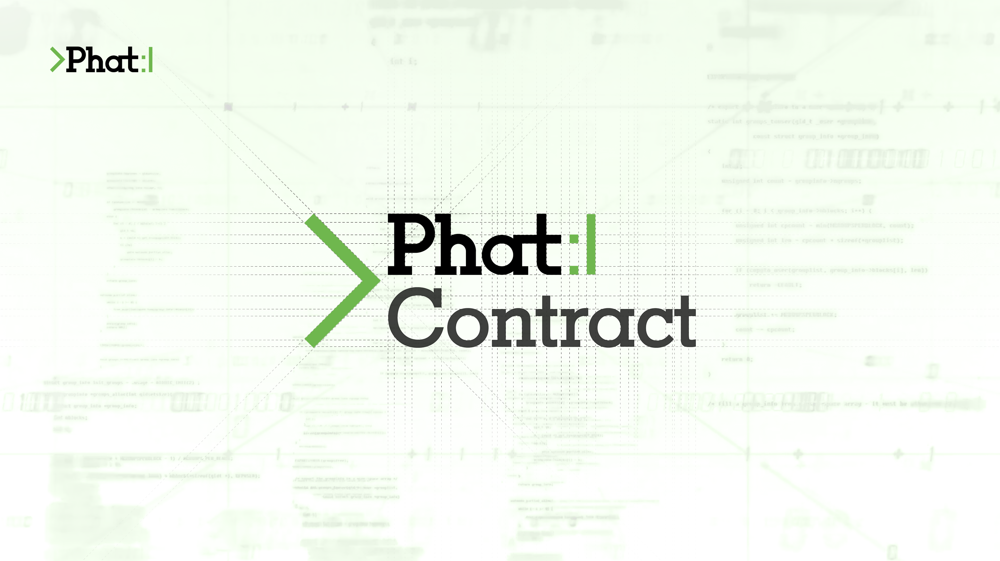
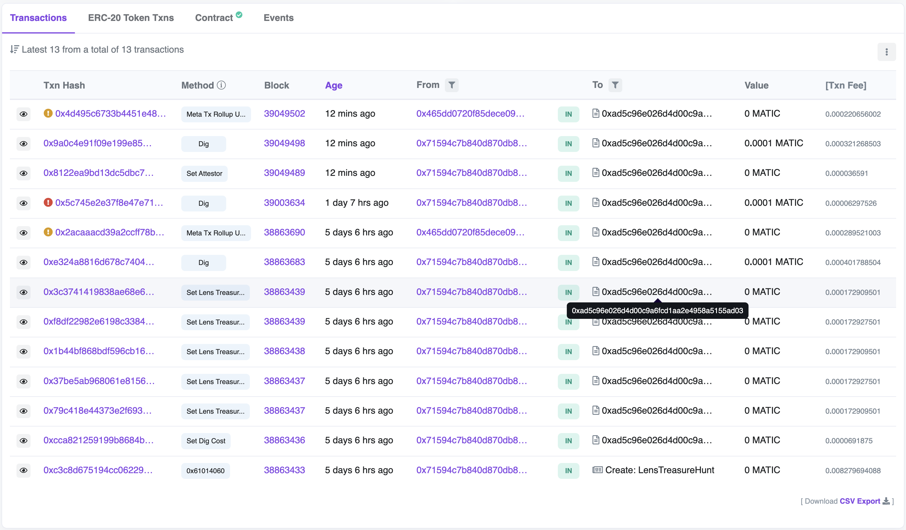

# Lens Treasure Hunt :pick: for LensAPI Oracle


**Table of Contents**
- [Overview](#overview)
- [Prerequisites](#prerequisites)
- [Getting Started](#getting-started)
  - [Environment Variables](#environment-variables)
- [Deployment](#deployment)
  - [Deploy to Polygon Mumbai Testnet](#deploy-to-polygon-mumbai-testnet)
    - [Verify Contract on Polygon Mumabai Testnet](#verify-contract-on-polygon-mumbai-testnet)
    - [Interact with Consumer Contract on Polygon Mumbai](#interact-with-consumer-contract-on-polygon-mumbai)
  - [Deploy to Polygon Mainnet](#deploy-to-polygon-mainnet)
    - [Verify Contract on Polygon Mainnet](#verify-contract-on-polygon-mainnet)
    - [Interact with Consumer Contract on Polygon Mainnet](#interact-with-consumer-contract-on-polygon-mainnet)
- [Closing](#closing)

## Overview
This project represents a Lens Treasure Hunt Consumer Contract that is compatible with a deployed LensAPI Oracle via [Phat Bricks UI](https://bricks.phala.network).

For more info on the design, check out this [blog post](https://medium.com/@hashwarlock/lensapi-oracle-lens-treasure-hunt-7e1ad93b5a29).

## Prerequisites
- Active deployed LensAPI Oracle Blueprint via [Phat Bricks](https://bricks.phala.network)
- Address of the "[Oracle Endpoint](https://docs.phala.network/developers/bricks-and-blueprints/featured-blueprints/lensapi-oracle#step-3-connect-your-smart-contract-to-the-oracle)" in deployed LensAPI Oracle
- [Hardhat](https://hardhat.org)
- For Polygon Mainnet deployments:
  - Polygonscan API Key that can be generated on [polygonscan](https://polygonscan.com)
- RPC Endpoint for Polygon Mainnet & Mumbai Testnet
  - [Alchemy](https://alchemy.com) - This repo example uses Alchemy's API Key.
  - [Infura](https://infura.io)
  - Personal RPC Node

## Getting Started
First you will need to run `cp .env.local .env` to copy over the local environment variables.
### Environment Variables:
- `MUMBAI_RPC_URL` - JSON-RPC URL with an API key for RPC endpoints on Polygon Mumbai Testnet (e.g. [Alchemy](https://alchemy.com) `https://polygon-mumbai.g.alchemy.com/v2/<api-key>`, [Infura](https://infura.io) `https://polygon.infura.io/v3/<api-key>`).
- `POLYGON_RPC_URL` - JSON-RPC URL with an API key for RPC endpoints on Polygon Mainnet (e.g. [Alchemy](https://alchemy.com) `https://polygon.g.alchemy.com/v2/<api-key>`, [Infura](https://infura.io) `https://polygon.infura.io/v3/<api-key>`).
- `DEPLOYER_PRIVATE_KEY` - Secret key for the deployer account that will deploy the Consumer Contract on either Polygon Mainnet or Polygon Mumbai Testnet.
- `POLYGONSCAN_API_KEY` - Polygonscan API Key that can be generated at [polygonscan](https://polygonscan.com).
- `MUMBAI_LENSAPI_ORACLE_ENDPOINT` - LensAPI Oracle Endpoint Address that can be found in the dashboard of the deployed LensAPI Oracle Blueprint at [Phala PoC5 Testnet](https://bricks-poc5.phala.network) for Polygon Mumbai Testnet.
- `POLYGON_LENSAPI_ORACLE_ENDPOINT` - LensAPI Oracle Endpoint Address that can be found in the dashboard of the deployed LensAPI Oracle Blueprint at [Phala Mainnet](https://bricks.phala.network) for Polygon Mainnet.

## Deployment
Now that you have the prerequisites to deploy a Polygon Consumer Contract on Polygon, lets begin with some initials tasks.
### Install Dependencies & Compile Contracts
```shell
# install dependencies
$ yarn

# compile contracts
$ yarn compile
```
### Deploy to Polygon Mumbai Testnet
With the contracts successfully compiled, now we can begin deploying first to Polygon Mumbai Testnet. If you have not gotten `MATIC` for Mumbai Testnet then get `MATIC` from a [faucet](https://mumbaifaucet.com/).
Ensure to save the address after deploying the Consumer Contract because this address will be use in the "[Configure Client](https://docs.phala.network/developers/bricks-and-blueprints/featured-blueprints/lensapi-oracle#step-4-configure-the-client-address)" section of Phat Bricks UI. The deployed address will also be set to the environment variable [`MUMBAI_CONSUMER_CONTRACT_ADDRESS`](./.env.local).
```shell
# deploy contracts to testnet mumbai
$ yarn test-deploy
# Deployed { consumer: '0x50B619C3f79C4502223a8C805eE9Ab87e4bC0901' }

# Check our example deployment in <https://mumbai.polygonscan.com/address/0x50B619C3f79C4502223a8C805eE9Ab87e4bC0901>
```
#### Verify Contract on Polygon Mumbai Testnet
Ensure to update the [`mumbai.arguments.ts`](./mumbai.arguments.ts) file with the constructor arguments used to instantiate the Consumer Contract. If you add additional parameters to the constructor function then make sure to update the `mumbai.arguments.ts` file.
> **Note**: Your contract address will be different than `0x50B619C3f79C4502223a8C805eE9Ab87e4bC0901` when verifying your contract. Make sure to get your actual contract address from the console log output after executing `yarn test-deploy`.
```shell
$ yarn test-verify 0x50B619C3f79C4502223a8C805eE9Ab87e4bC0901
Nothing to compile
No need to generate any newer typings.
Successfully submitted source code for contract
contracts/TestLensApiConsumerContract.sol.sol.sol:TestLensApiConsumerContract.sol at 0x50B619C3f79C4502223a8C805eE9Ab87e4bC0901
for verification on the block explorer. Waiting for verification result...

Successfully verified contract TestLensApiConsumerContract.sol on Etherscan.
https://mumbai.polygonscan.com/address/0x50B619C3f79C4502223a8C805eE9Ab87e4bC0901#code
Done in 8.88s.
```
#### Interact with Consumer Contract on Polygon Mumbai
Test Consumer Contract on Mumbai with a few tests to check for successful/unsuccessful digs, and set the attestor.
```shell
# set the attestor to the Oracle Endpoint in Phat Bricks UI
$ yarn test-set-attestor
$ hardhat run --network mumbai ./scripts/mumbai/set-attestor.ts
Setting attestor...
Done
✨  Done in 2.27s.
# execute a dig on a lens profile id and pay the digging cost.
$ yarn test-push-dig
$ hardhat run --network mumbai ./scripts/mumbai/push-dig.ts
Pushing a request to dig...
digCost: 100000000000000
Done
✨  Done in 2.02s.
```

### Deploy to Polygon Mainnet
Ensure to save the address after deploying the Consumer Contract because this address will be used in the "[Configure Client](https://docs.phala.network/developers/bricks-and-blueprints/featured-blueprints/lensapi-oracle#step-4-configure-the-client-address)" section of Phat Bricks UI. The deployed address will also be set to the environment variable [`POLYGON_CONSUMER_CONTRACT_ADDRESS`](./.env.local).
> **Note**: Your contract address will be different than `0x50B619C3f79C4502223a8C805eE9Ab87e4bC0901` when verifying your contract. Make sure to get your actual contract address from the console log output after executing `yarn main-deploy`.
```shell
# deploy contracts to polygon mainnet
$ yarn main-deploy
Deploying...
Deployed { consumer: '0x50B619C3f79C4502223a8C805eE9Ab87e4bC0901' }
Configuring...
Done

# Check our example deployment in <https://polygonscan.com/address/0xbb0d733BDBe151dae3cEf8D7D63cBF74cCbf04C4>
```
#### Verify Contract on Polygon Mainnet
Ensure to update the [`polygon.arguments.ts`](./polygon.arguments.ts) file with the constructor arguments used to instantiate the Consumer Contract. If you add additional parameters to the constructor function then make sure to update the `polygon.arguments.ts` file.
```shell
$ yarn main-verify 0xbb0d733BDBe151dae3cEf8D7D63cBF74cCbf04C4
Nothing to compile
No need to generate any newer typings.
Successfully submitted source code for contract
contracts/TestLensApiConsumerContract.sol.sol:TestLensApiConsumerContract.sol.sol at 0xbb0d733BDBe151dae3cEf8D7D63cBF74cCbf04C4
for verification on the block explorer. Waiting for verification result...

Successfully verified contract TestLensApiConsumerContract.sol on Etherscan.
https://polygonscan.com/address/0xbb0d733BDBe151dae3cEf8D7D63cBF74cCbf04C4#code
Done in 8.88s.
```

#### Interact with Consumer Contract on Polygon Mainnet
Execute Scripts to Consumer Contract on Polygon Mainnet. The Consumer Contract on Polygon Mainnet with a few actions for successful/unsuccessful digs, and set the attestor.
```shell
# set the attestor to the Oracle Endpoint in Phat Bricks UI
$ yarn test-set-attestor
$ hardhat run --network mumbai ./scripts/mumbai/set-attestor.ts
Setting attestor...
Done
✨  Done in 2.27s.
# execute a dig on a lens profile id and pay the digging cost.
$ yarn test-push-dig
$ hardhat run --network mumbai ./scripts/mumbai/push-dig.ts
Pushing a request to dig...
digCost: 100000000000000
Done
✨  Done in 2.02s.
```

## Closing
Once you have stored the deployed address of the Lens Treasure Hunt Contract and set the value in the "Configure Client" section of the deployed LensAPI Oracle, you will now have a basic boilerplate example of how to connect your Polygon dApp to a LensAPI Oracle Blueprint. Execute a new `Dig :pick:` and check if your configuration is correct like below:
> **Note**: You may notice failures or execution reverts in the screenshot below. This is expected as the NFT Contracts have not granted the `Minter` role to the Lens Treasure Hunt Smart Contract.


